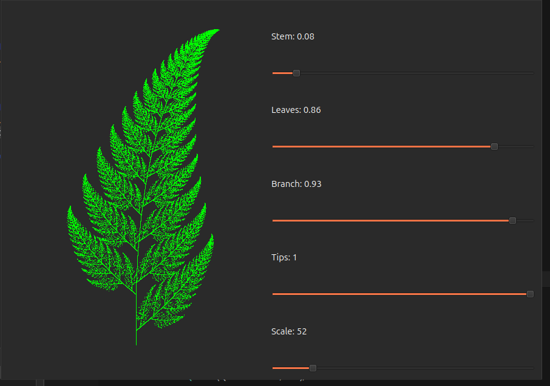

# Barnsley Fern

Проект для отрисовки фрактала папоротника Барнсли с использованием библиотеки Qt6. Этот проект демонстрирует использование системы итерированных функций (IFS) для генерации фрактальных изображений.

## Описание

Этот проект позволяет пользователю визуализировать папоротник Барнсли, используя аффинные преобразования. Пользователь может изменять параметры вероятности для различных преобразований, масштабировать изображение, и менять скорость вращения с помощью ползунков.


Статическое прдставление интерфейса:



Представление с анимацией вращения:


## Требования

Для сборки и запуска этого проекта вам понадобятся:

- Компилятор C++ с поддержкой стандарта C++17
- Qt 6
- CMake (версия 3.16 или выше)
- Git

### Клонирование репозитория

Сначала клонируйте репозиторий на ваш локальный компьютер:

```bash

git clone https://github.com/BaksNprogrammer/BarnsleyFern.git
cd BarnsleyFern

```

## Установка и запуск
Установите необходимые пакеты:
### Linux (Debian/Ubuntu):

```bash

sudo apt-get update
sudo apt-get install build-essential cmake qt6-base-dev

```

### Windows:
```bash

choco install cmake
choco install qt6

```
### macOS

```bash
brew update
brew install cmake qt
```
### Сборка и запуск проекта

```bash

mkdir build
cd build

```

```bash

cmake ..
cmake --build .

```
```bash
./BarnsleyFern
```


